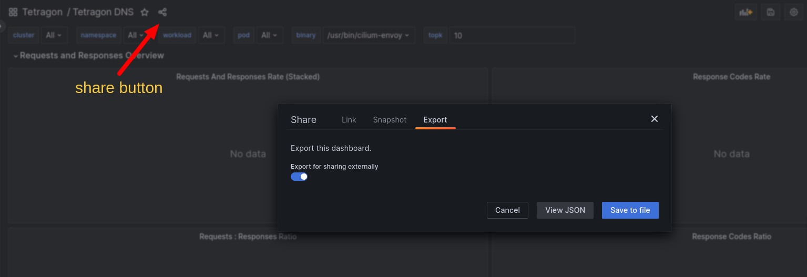
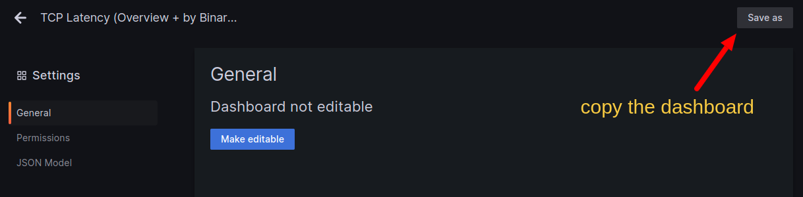
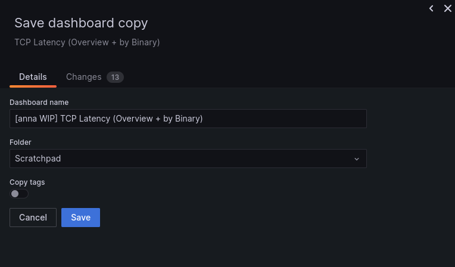

This directory contains Grafana dashboards that are NOT stable, for example
experimental or development ones. Stable dashboards, suitable for customers'
use, are stored under `install/kubernetes/enterprise/dashboards` and are
installable via the Helm chart.

To add a new dashboard, export it to JSON using the "share" functionality in Grafana:

Optionally, add a few screenshots and a short README alongside the JSON file.
It's required only if you want the dashboard to be published at grafana.com, but it's recommended in all cases, as it makes the dashboard easier to use for example in marketing and sales activities.

When creating a pull request, include a link to the dashboard in a live Grafana instance. If you're making changes to an existing dashboard, describe them in the PR description, as the JSON diff often ends up unreadable.

It's recommended to mark dashboards that you're not actively working on as read-only to prevent accidental changes.
The Grafana UI doesn't provide a great interface for collaboration. If you want to make changes to a dashboard or copy parts of it, then go to settings and create a working copy:

