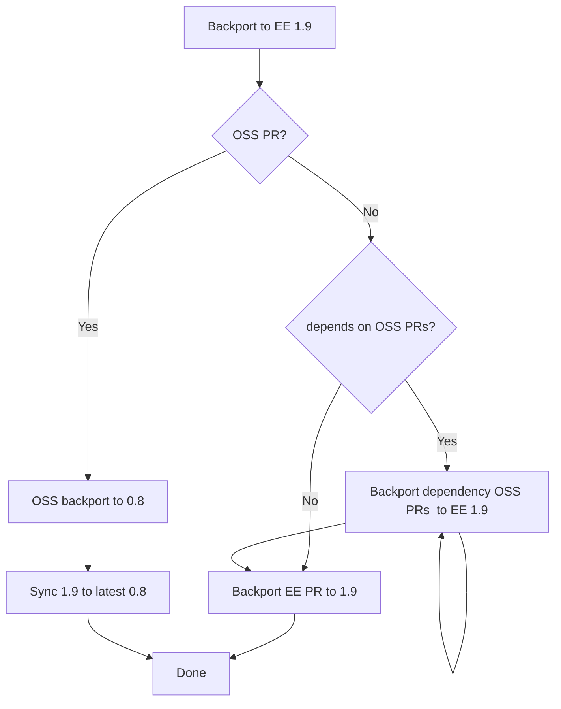

# Backporting

Note: we follow the Cilium backporting process, as described in
https://docs.cilium.io/en/latest/contributing/release/backports/ as much as we can.

##  Versions

Currently, we maintain three stable branches (https://docs.isovalent.com/operations-guide/features/tetragon/release-cadence.html):

As of Tetragon EE 1.9, each EE version is in sync with an OSS version.

Supported versions:

| EE     | OSS  |
| -----  | ---- |
| 1.18   | 1.6  |
| 1.17   | 1.5  |
| 1.16   | 1.4  |
| 1.15   | 1.3  |

Unsupported versions:

| EE     | OSS  |
| -----  | ---- |
| 1.14   | 1.2  |
| 1.13   | 1.1  |
| 1.12   | 1.0  |
| 1.11   | 0.10 |
| 1.10   | 0.9  |
| 1.9    | 0.8  |

Hence, backporting PRs that are in OSS or have dependencies in PRs that _are_ in OSS needs to go via
the correspodning OSS version first (0.8 for 1.9). Once everything is backported in OSS, the EE
version should be synced accordingly and any EE-specific PRs can now be backported as well.

For 1.9, for example:



Note that above applies only to EE 1.9, where there is an OSS module. For 1.8, backports from OSS
need to be done directly into the EE version.

## What are the backport criteria?

Should I backport a PR?
 - Does it fix a customer-related issue? YES
 - Does it fix an issue with a non-negligible chance that will hit customers? YES
 - Does it fix an issue (e.g., CI fix) that will affect our CI for stable versions? YES
 - Does it improve our QoL (e.g., release automation) -> case-by-case (see below)
 - Does it make it asier to backport any of the above -> case-by-case (see below)

Case-by-case: Evaluate case-by-case based on the following factors:
 - Is there a chance to break things that work (especially in customer setups)?
 - Is the utiliity offered by the backport worth the effort?

## What PRs should be backported?

Similary, to Cilium we use the the `needs-backport/X.Y` label to mark PRs that need to be
backported. Similarly, we use `backport-pending/X.Y` and `backport-done/X.Y` to mark that a PR
backport is pending and finished, respectively. 

## How do I backport a PR?

For now this is done manually.  That is, for every commit cherry-pick the commit. As done in Cilium,
The upstream commit should be referenced in the commit message as well as any notes that related to
the backport (e.g., about conficts).

For example:
```
commit f0f09158ae7f84fc8d888605aa975ce3421e8d67
Author: Joe Stringer <joe@cilium.io>
Date:   Tue Apr 20 16:48:18 2021 -0700

    contrib: Automate digest PR creation

    [ upstream commit 893d0e7ec5766c03da2f0e7b8c548f7c4d89fcd7 ]

    [ Backporter's notes: Dropped conflicts in .github/ issue template ]

    There's still some interactive bits here just for safety, but one less
    step in the template.

    Signed-off-by: Joe Stringer <joe@cilium.io>
```

Eventually, we will use the scripts used by Cilium to do this, but we are not there yet.

## CRD changes

In rare situations, we might want to backport CRD changes, which means changing the CRD schema
version. In these cases, we need to maintain the major and minor versions of the CRD schema.

So, for example a CRD change in 1.12 that does:

```diff
- 	CustomResourceDefinitionSchemaVersion = "1.12.9"
+ 	CustomResourceDefinitionSchemaVersion = "1.12.10"
```

Should be backported in 1.11 as:

```diff
- 	CustomResourceDefinitionSchemaVersion = "1.11.30"
+ 	CustomResourceDefinitionSchemaVersion = "1.11.31"
```
