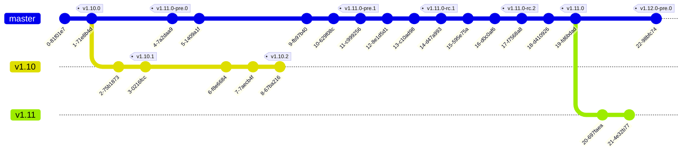
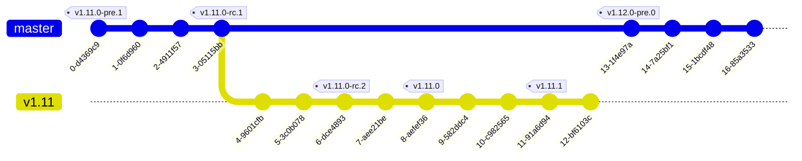

# How to create git tags for releases

This covers both OSS and EE.

The first version of a release (e.g., `v1.10.0`) is tagged on `master` (or `main` for OSS) and this
is the branch point for the release branch (e.g., `v1.10`). All `v1.10.*` tags except `v1.10.0` will
be in the `v1.10` branch.

The first commit after a release tag on `master` is tagged as the next release version `-pre.0`
(e.g., `v1.11.0-pre.0`). This means that all build versions from now on will have a `v1.11`
prefix. We tag all pre-releases (including `-rc` versions) in the `master` branch.

## Exceptions

Above should be treated as a guideline rather than unbreakable rule. Specifically, the motivation
for branching the release branch after `vx.y.0` is to minimize backporting. If however there is work
in the main branch that might be disruptive to the stability of the release, we can branch of sooner
(e.g., in the first or a later rc).

Here's an example:

